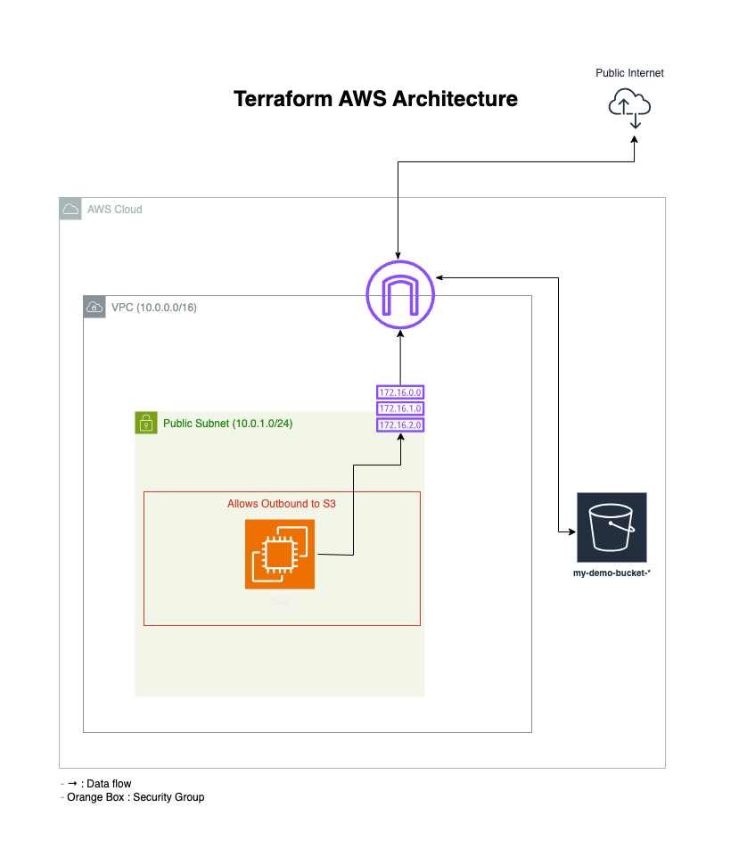

# Terraform AWS Demo

Deploys a VPC, subnet, EC2 instance, and S3 bucket on AWS.

## Setup
1. Install Terraform and AWS CLI.
2. Configure AWS: `aws configure`.
3. Run:
   ```bash
   terraform plan -out=plan.tfplan
   terraform apply "plan.tfplan"
4. Clean up: `terraform destroy`

